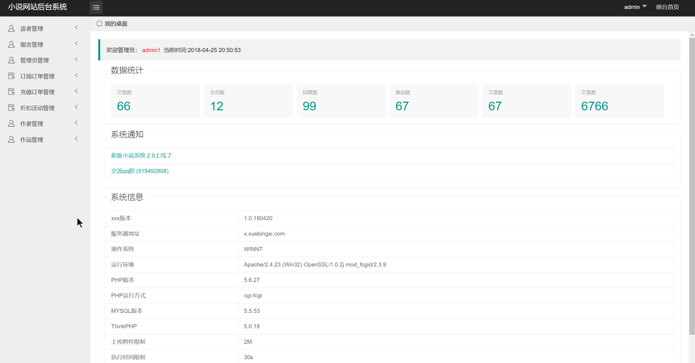
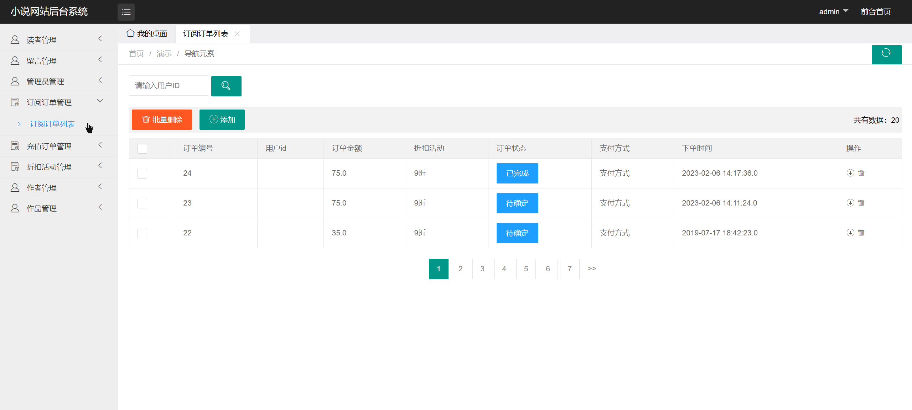
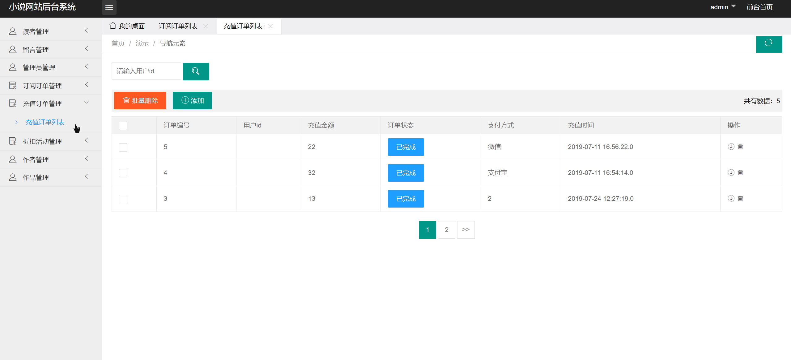
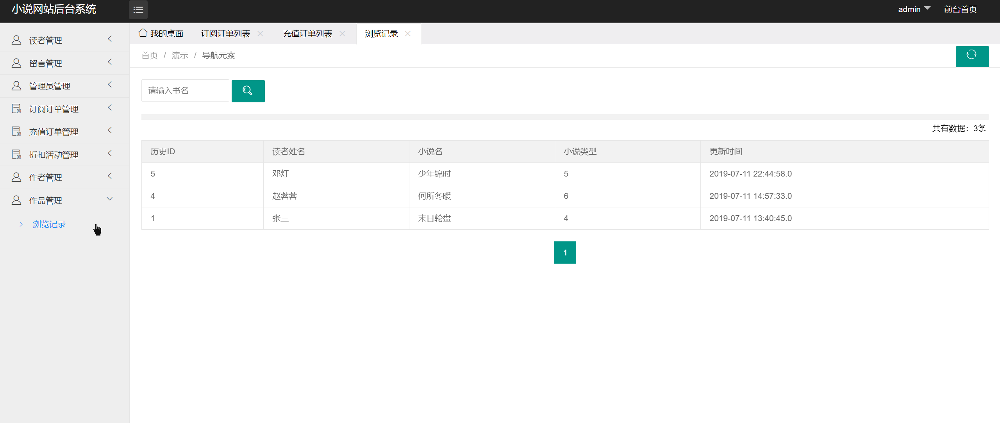
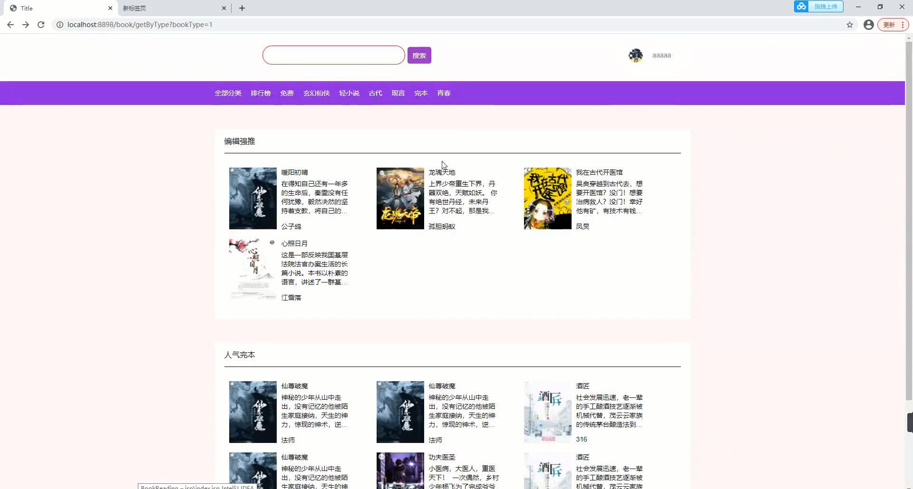
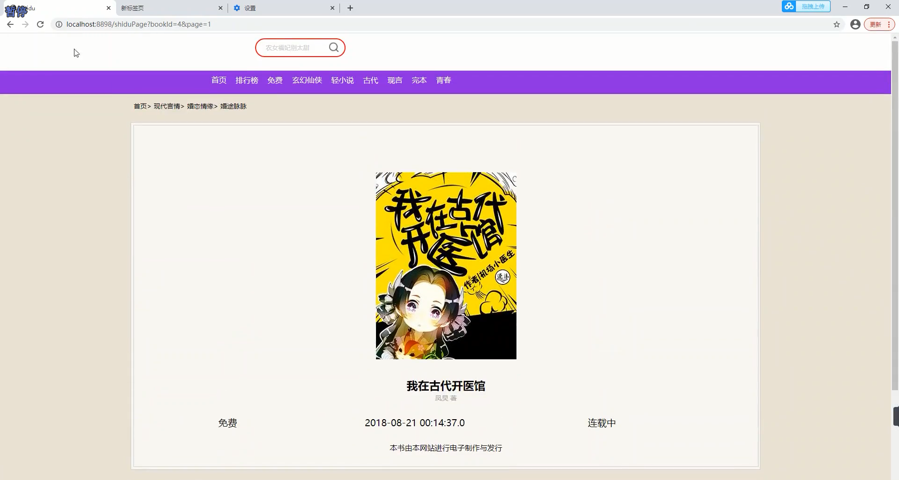
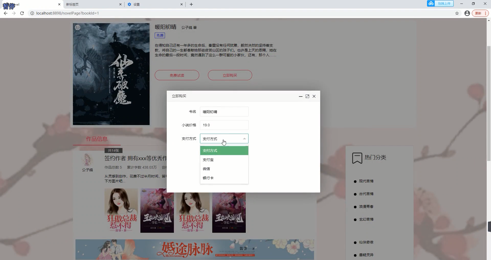

## 基于SSM框架的在线小说阅读系统

- <b>完整代码获取地址：从戎源码网 ([https://armycodes.com/](https://armycodes.com/))</b>
- <b>技术探讨、资料分享，请加QQ群：692619798</b> 
- <b>作者微信：19941326836  QQ：952045282</b> 
- <b>承接计算机毕业设计、Java毕业设计、Python毕业设计、深度学习、机器学习</b>
- <b>选题+开题报告+任务书+程序定制+安装调试+论文+答辩ppt 一条龙服务</b>
- <b>所有选题地址 ([https://github.com/YuLin-Coder/AllProjectCatalog](https://github.com/YuLin-Coder/AllProjectCatalog)) </b>

## 项目介绍
基于SSM框架的在线小说阅读系统，有用户、作者、管理员三个角色，主要功能如下
【用户模块】
- 游客可以浏览网站的主页，查看推荐小说和热门小说等信息。
- 用户可以进行注册和登录，以便获取更多功能和个性化推荐。
- 用户可以浏览小说列表，按照分类、作者、热度等进行筛选和搜索。
- 用户可以购买小说，选择订阅或按章节购买，并查看订单记录和购买历史。
- 用户可以查看个人信息，修改密码、上传头像等。
- 用户可以留言和评论，与其他读者交流和互动。

【作者模块】
- 作者可以进行注册和登录，以便发布和维护自己的小说。
- 作者可以发表新的小说作品，编辑和更新已有的小说章节。
- 作者可以查看小说的订阅和销售情况，了解读者的反馈和评论。

【管理员模块】
- 管理员可以进行注册和登录，以便管理系统的各项功能。
- 管理员可以管理读者账号，包括添加、编辑和删除用户信息。
- 管理员可以管理小说信息，包括添加、编辑和删除小说，审核作者发布的小说。
- 管理员可以管理评论，包括审核和删除不当评论。
- 管理员可以管理充值订单和订阅订单，处理用户的支付和订阅需求。
- 管理员可以设置折扣活动，吸引用户购买和订阅小说。

## 项目技术
- 编程语言：Java
- 数据库：MySQL
- 前端技术：JSP、JavaScript、Jquery
- 后端技术：Spring、SpringMVC、MyBatis

## 运行环境
- JDK版本：JDK1.8及以上
- 开发工具：IDEA、Ecplise、Myecplise都可以
- 数据库: MySQL5.7及以上

## 运行截图

